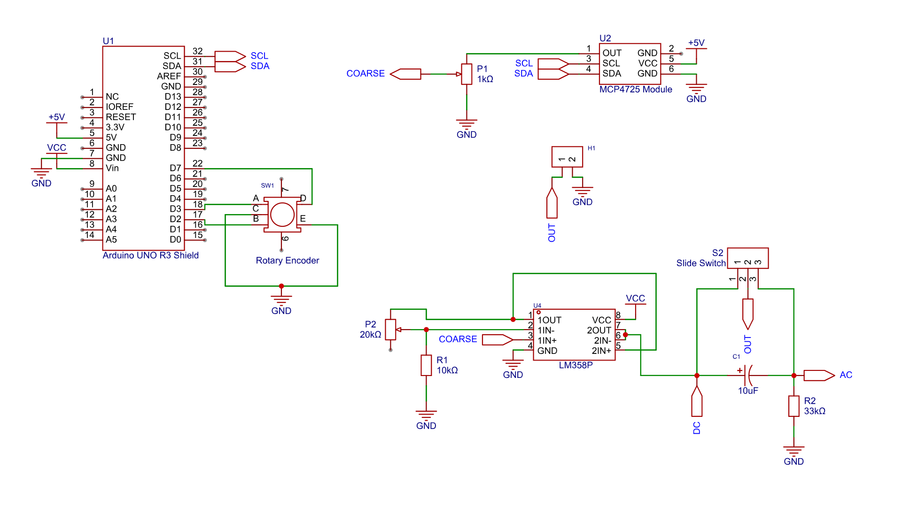

# Arduino UNO and MCP4725 based mini function generator

A simple function generator using Arduino UNO as the brain of the circuit and a MCP4725 DAC to obtain simple analog function voltages

## Features
- 3 different waves
  - Square
  - Triangle
  - Sine
- Frequency Modulation
- Pulse width Modulation
- Adjustable Symmetry

## Usage instructions

- Wire up the circuit as shown in the schematic below
  **NOTE**: You can also use any type of arduino, but do mind the pins and connect the components according to the pins mentioned

- Upload the <a href="./FinalCodeUsed.ino">FinalCodeUsed.ino</a> into your arduino

It is recommended to power up your arduino by a external supply, like a DC jack of 12V to get maximum voltage swings.

___

**Waveform modulations**

- By default, when you rotate the rotary encoder, the waveform should be changing.
- Press the rotary encoder once. Now, upon rotating the encoder, the frequency of the waveform should be changing.
- Press it one more time, and you should be able to change the duty cycle / symmtery of the waveform (not applicable for sine wave).

Optionally, you can keep track on what mode you are in by connecting some LEDs to pin D4 (Frequency Modulation), D5 (Pulse width / Symmetry Modulation), D6 (Waveform change); which will glow accordingly to what mode the circuit is in right now.

___

**Amplitude modulation**

- By varying the 2 potentiometers (P1, P2) you can vary the amplitude of the generated waveform, from 0 to Vcc (nominally)

___

**Coupling**

- The generated wavefrom can be AC/DC coupled by using the slide switch.

___

###### NOTE: Triangle and Sine waves are not as smooth as they should be, this is because of the low processing power of the arduino in use.